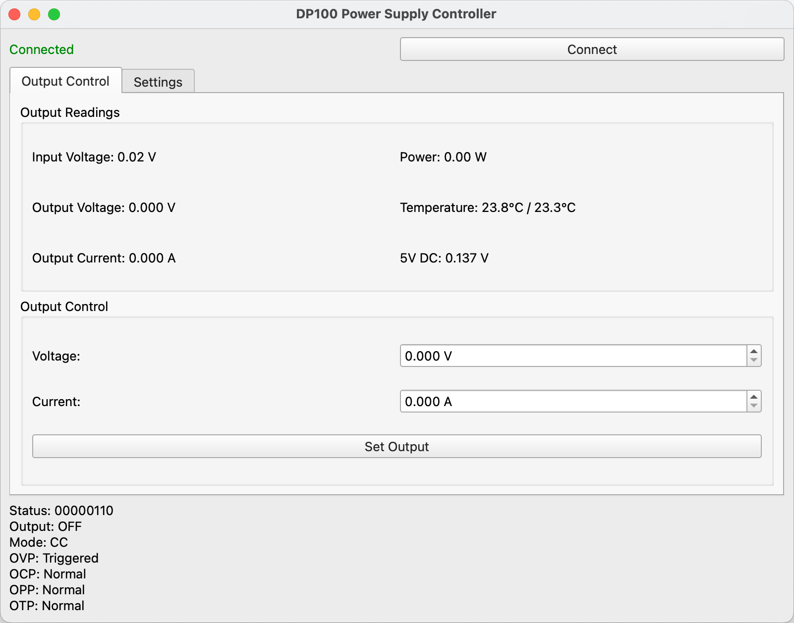

# DP100 Power Supply Controller

A lightweight interface for AlienTek DP100 power supplies.



## Features

- Real-time display of voltage, current, power, and temperature
- Set output voltage and current (This feature is not working yet)
- Monitor power supply status
- Easy-to-use PyQt6-based interface

## Requirements

- Python 3.x
- A DP100 power supply connected via it's USB(-A) connector

## Installation

1. Clone the repository:
   ```shell
   git clone https://github.com/sammcj/dp100.git
   cd dp100
   ```

2. Install dependencies:
   ```shell
   pip install -r requirements.txt
   ```

## Usage

Run the main script:

```shell
python main.py
```

The GUI will launch, automatically attempting to connect to the DP100 power supply.

## DP100 Power Supply

It's available on all the usual sources such as [AliExpress](https://www.aliexpress.com/item/1005005992326848.html)


EEVBlog did an intro and tear-down of the DP100 power supply:

[](https://www.youtube.com/watch?v=Pd6LG7iP2GQ)

## Future Enhancements

A list of possible future enhancements I might add:

- [ ] Fix writing to the power supply
- [ ] Read Only / Write mode button
- [ ] Save and load settings
- [ ] Real-time graphing of voltage, current, power etc
- [ ] A stream of data logging in the UI
- [ ] Customisable data logging intervals
- [ ] CSV/JSON export of data
- [ ] Programmable output sequences (e.g., ramp up/down, pulse generation)
- [ ] Automatic shutdown options based on user-defined conditions
- [ ] Simulation mode for testing without physical hardware

## Contributing

Contributions are welcome! Please feel free to submit a Pull Request.

## License

MIT License

## Acknowledgements

This project uses cython, PyQt6 and hidapi for USB communication.
